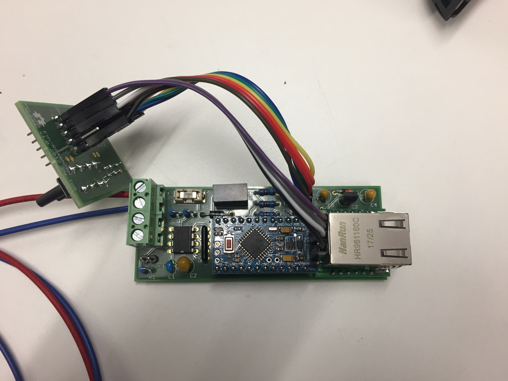
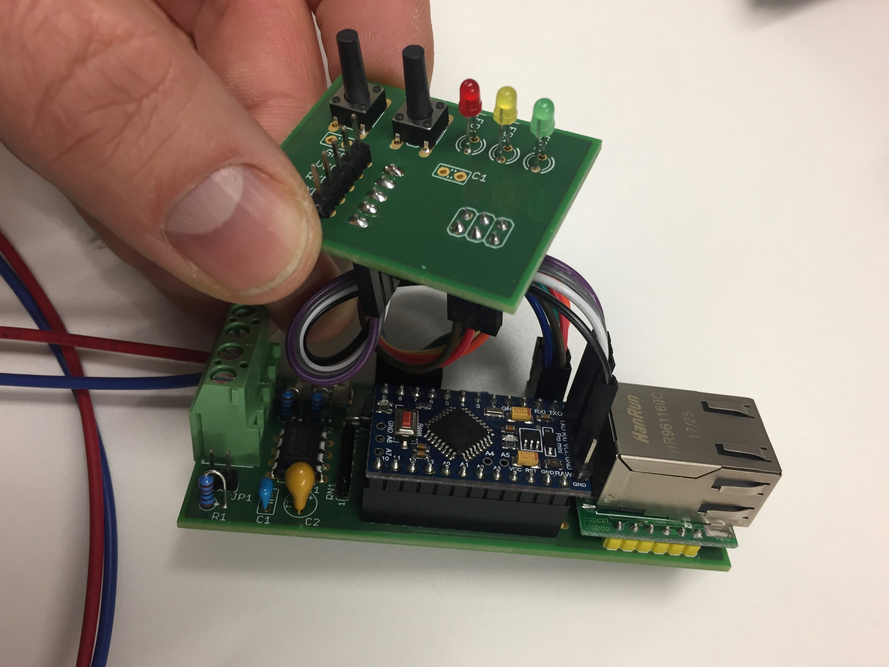
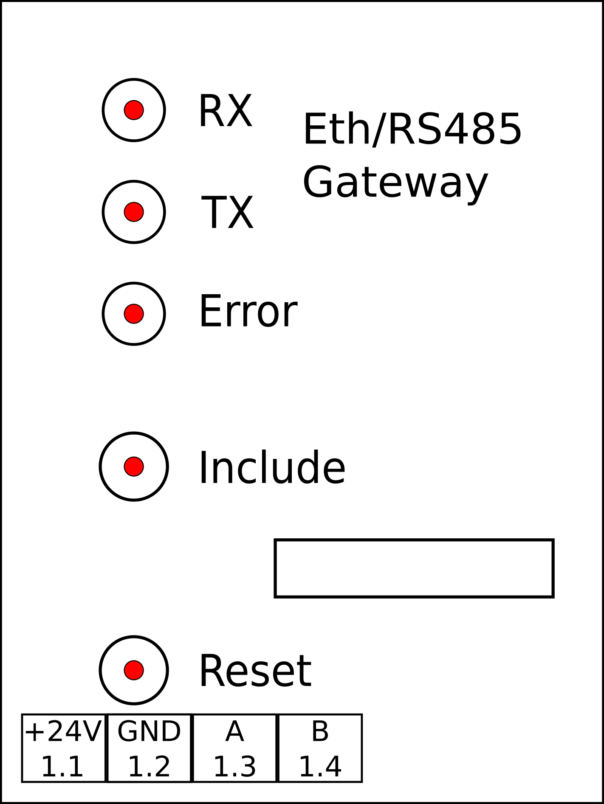

# mySensors-EthRs485Gateway-Hardware

The mySensors-EthRs485Gateway-Hardware is a mySensors compatible Ethernet / RS485 gateway that is designed to fit in a DIN rail enclosure.

The PCB dimensions are designed to fit in a [CAMDENBOSS CNMB/2/KIT DIN](http://camdenboss.com/enclosures/din-rail-enclosures/cnmb-solid-top-kit) rail enclosure - with a litte mod... ;) 

The firmware that works with this gateway can be found at https://github.com/tomarc3/mySensors-EthRs485Gateway

The front panel:

## Refereneces
* https://github.com/tomarc3/mySensors-EthRs485Gateway - the firmware built to run on this hardware
* https://www.mysensors.org - mySensors home page
* https://www.mysensors.org/build/rs485 - the example sketch that served as reference for this project 
* http://camdenboss.com/enclosures/din-rail-enclosures/cnmb-solid-top-kit - CAMDENBOSS CNMB/2/KIT DIN rail enclosure

## Change Log
* v1.0 ()
   Initial version.

## License
Copyright 2018 by Tom Kocher.

This documentation describes Open Hardware and is licensed under the CERN OHL v.1.2.

You may redistribute and modify this documentation under the terms of the CERN OHL v.1.2. (http://ohwr.org/cernohl). This documentation is distributed WITHOUT ANY EXPRESS OR IMPLIED WARRANTY, INCLUDING OF MERCHANTABILITY, SATISFACTORY QUALITY AND FITNESS FOR A PARTICULAR PURPOSE. Please see the CERN OHL v.1.2 for applicable conditions
